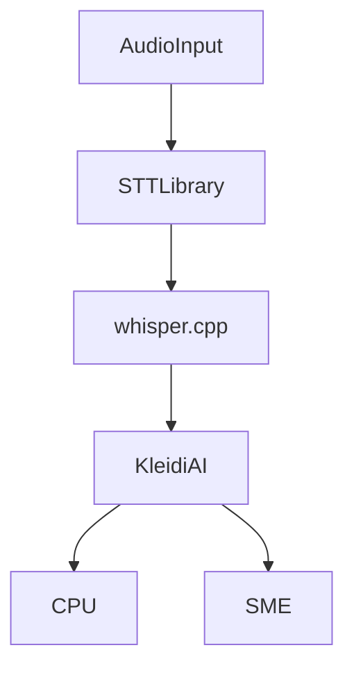

<!--
SPDX-FileCopyrightText: Copyright 2024-2026 Arm Limited and/or its affiliates <open-source-office@arm.com>
SPDX-License-Identifier: Apache-2.0
-->

# Speech to Text Library

## Table of Contents

- [Overview](#overview)
- [Quick Start](#quick-start)
- [Prerequisites](#prerequisites)
- [Architecture](#architecture)
- [Supported Platforms & cmake presets](#supported-platforms--cmake-presets)
  - [Build Options](#build-options)
- [Documentation](#documentation)
- [Repository Structure](#repository-structure)
- [Building with/without KleidiAI + SME](#building-withwithout-kleidiai--sme)
  - [Linux with KleidiAI + SME](#linux-with-kleidiai--sme)
  - [Linux without KleidiAI](#linux-without-kleidiai)
  - [macOS native (optional custom CPU flags)](#macos-native-optional-custom-cpu-flags)
  - [To Build and Run the Benchmark Executable](#to-build-and-run-the-benchmark-executable)
  - [To Build a JNI lib](#to-build-a-jni-lib)
  - [Unit tests](#unit-tests)
- [Android Build and Execution](#android-build-and-execution)
  - [With KleidiAI kernels + SME](#with-kleidiai-kernels--sme)
- [Performance Evaluation](#performance-evaluation)
  - [Arm Streamline support](#arm-streamline-support)
- [Integration Guidance](#integration-guidance)
- [Neural Network Used](#neural-network-used)
- [Contributions](#contributions)
- [Trademarks](#trademarks)
- [License](#license)

---

# Overview


This project provides a platform-agnostic Speech-to-Text (STT) library that makes it easier to add Automatic Speech Recognition (ASR) capabilities to both new and existing applications.

For Arm targets, the library builds optimised binaries that take full advantage of Arm's advanced AI/ML CPU features via **Arm® KleidiAI™** , ensuring the best on-device CPU performance is achieved for AI/ML workloads.

It includes built-in support for Java and Kotlin, with no extra wrapper code required. The library can be integrated into an Android project quickly using a simple build script.

The library supports Android, Linux-aarch64, Linux-x86, and macOS. This makes it easy to develop and test STT features on Linux or macOS, then deploy to Android with minimal effort.
The library wraps the underlying inference engine (`whisper.cpp`) behind behind lightweight C++ and Java APIs and when targeting Arm platforms, automatically enables [**Arm® KleidiAI™**](https://www.arm.com/markets/artificial-intelligence/software/)
 kernels by default to deliver optimal CPU acceleration.

Typical uses include:

- voice assistants
- speech transcription tools
- embedded voice interfaces
- Android™ applications

---

# Quick Start

Please see:

- [docs/quickstart.md](docs/quickstart.md)

---

# Prerequisites

Required tools:

- **CMake 3.27+**
- **Python 3.9+**
- **Android™ NDK 29.0.14033849** (for Android builds)
- **aarch64 toolchain** (tested with v11.2‑2022.02)


---

# Architecture



# Supported Platforms & cmake presets

CMake presets are used to simplify build commands. You can use any of the standard presets (`native`, `x-android-aarch64`, `x-linux-aarch64`) as follows:

Example:

```bash
cmake -B build --preset=native -DBUILD_EXECUTABLE=ON
cmake --build build
```

The supported build platforms and cmake presets matrix is given below.
The cmake presets (aka build target) are given in the first column and build platform in the first row.
So for example native builds are have been tested on Linux-x86_64, Linux-aarch64 & macOS-aarch64. While x-android-aarch64 (targets Android™ devices running on aarch64) builds are only tested on Linux-x86_64 & macOS-aarch64.

|  cmake-preset / Host Platform  | Linux-x86_64| Linux-aarch64                      | macOS-aarch64 | Android™ |
|--------------------------------------|---------------|------------------------------------|---------------|---------|
| native                               | ✅            | ✅                                | ✅            | -      |
| x-android-aarch64                    | ✅            | -                                 | ✅            | -      |
| x-linux-aarch64                      | ✅            | ✅ †                              | -            | -      |


† Use 'native' preset


---

### Build Options

Flag name | Default | Values | Description |
| --- | --- | --- | --- |
| `USE_KLEIDIAI` | ON | ON/OFF | Build with KleidiAI CPU optimizations; if OFF, optimizations are disabled. |
| `BUILD_UNIT_TESTS` | ON | ON/OFF | Builds unit tests when ON. |
| `BUILD_JNI_LIB` | ON | ON/OFF | Builds JNI bindings when ON. |
| `BUILD_SHARED_LIBS` | OFF | ON/OFF | Builds shared libraries when ON. |
| `BUILD_EXECUTABLE` | OFF | ON/OFF | Builds example CLI (`whisper-cli`) when ON. |
| `BUILD_BENCHMARK` | ON | ON/OFF | Builds the standalone benchmark executable (`stt-bench`) when ON. |
| `GGML_OPENMP` | OFF | ON/OFF | Enables OpenMP support when ON. |
| `GGML_METAL` | OFF | ON/OFF | macOS only. Enables Metal backend when ON. |
| `GGML_BLAS` | OFF | ON/OFF | macOS only. Enables BLAS backend when ON. |


# Documentation

| Guide       | Description                                                                 | Link                  |
| ----------- | --------------------------------------------------------------------------- | --------------------- |
| Overview    | Overview of all documentation                                               | [docs/README.md](docs/README.md)      |
| Quickstart  | Get up and running quickly                                                  | [docs/quickstart.md](docs/quickstart.md)  |
| Performance | Performance tuning and benchmarks                                           | [docs/benchmarking.md](docs/benchmarking.md) |
| Integration | Integrate the STT-Runner library into your application using available APIs | [docs/integration.md](docs/integration.md)     |
| Contributing | Contribution guide for this repo | [docs/contributing.md](docs/contributing.md)     |
| Architecture | Overview of the repo and system| [docs/architecture.md](docs/architecture.md)     |


---

# Repository Structure

```
.
├── docs/                     Project documentation
├── scripts/                  Build helpers and resource scripts
├── src/                      Core STT abstraction layer
├── test/                     Unit tests
├── resources_downloaded/     Models and example inputs
└── CMakeLists.txt            Top level build configuration
```

---


# Building with/without KleidiAI + SME

#### Linux with KleidiAI + SME

```shell
cmake -B build --preset=native 

cmake --build ./build
```

Enable SME kernels at runtime:

```shell
GGML_KLEIDIAI_SME=1 ./build/bin/whisper-cli -m resources_downloaded/models/model.bin /path/to/audio.wav
```

Disable SME kernels at runtime:

```shell
GGML_KLEIDIAI_SME=0 ./build/bin/whisper-cli -m resources_downloaded/models/model.bin /path/to/audio.wav
```

#### Linux without KleidiAI
```shell
cmake -B build \
    cmake -B build --preset=native -DUSE_KLEIDIAI=OFF

cmake --build ./build
```

#### macOS native (optional custom CPU flags)

```shell
cmake -B build --preset=native

cmake --build ./build
```
NOTE: If you need specific version of Java set the path in JAVA_HOME environment variable.

```
export JAVA_HOME=$(/usr/libexec/java_home)
```

#### To Build and Run the benchmark executable

The standalone benchmark executable is enabled by default via `BUILD_BENCHMARK=ON`.

For example:

```shell
cmake -B build --preset=native
cmake --build build --target stt-bench
```

Minimal usage only requires the model, the benchmark input size, and the thread count:

```shell
./build/bin/stt-bench --model resources_downloaded/models/model.bin --samples 160000 --threads 4
```

By default the benchmark uses `--iterations 5`, `--warmup 1`, `--language en`, and resolves `--shared-libs` from the executable directory.

#### To Build a JNI lib

Add the options:
```
-DBUILD_JNI_LIB=true
```

#### Unit tests
To run the unit tests

```shell
ctest --test-dir ./build
```
---


##  Android Build and Execution

These Android examples use the NDK toolchain directly (no presets). Set your NDK path first:

```shell
export NDK_PATH=/path/to/android-ndk
```

#### With KleidiAI kernels + SME

```shell
cmake -B build —preset=x-android-aarch64 -DBUILD_SHARED_LIBS=ON

cmake --build build
```

**To test the above build please do the following:**

Firstly push the newly built test executable:
```shell
adb push build/bin/stt-cpp-tests /data/local/tmp
```
Next push the newly built libs:
```shell
adb push build/lib/* /data/local/tmp
```
Next you will need to shell to your device:
```shell
adb shell
cd data/local/tmp
export LD_LIBRARY_PATH=./
```
Finally just run the test executable:
```shell
./stt-cpp-tests
```

---

# Performance Evaluation

Performance measurement and profiling instructions are available in:

- [docs/benchmarking.md](docs/benchmarking.md)

This includes:

- benchmarking methodology
- SME comparison guidance
- profiling with **Arm Streamline**
- tracing with **Perfetto**

> **NOTE (Testing)**: When `BUILD_UNIT_TESTS=ON`, the test model is downloaded via the Hugging Face Hub. If the model you configure is gated/private, set `HF_TOKEN` in your environment or add credentials to `~/.netrc` (machine `huggingface.co`).
> Example `~/.netrc` entry:
> `machine huggingface.co login __token__ password <YOUR_HF_TOKEN>`

## Arm Streamline support

See:

- [docs/benchmarking.md](docs/benchmarking.md#5-profile-with-arm-streamline)

---

# Integration Guidance

Guidance for integrating this library into other applications:

- [docs/integration.md](docs/integration.md)

Topics include:

- integrating with existing applications
- Android JNI usage
- build system integration

---

# Neural Network Used

Default model:

```
ggml-base.en
```

Model source:

https://huggingface.co/ggerganov/whisper.cpp

To reduce compute cost you may use quantized models (e.g. **Q4_0**) using the whisper.cpp quantization tool.

> Note: Only **Q4_0 models are currently accelerated by Arm® KleidiAI™ kernels**.

---

# Contributions

Contributions are welcome.

Please read:

- [contributing.md](docs/contributing.md)

---

# Trademarks

- Arm® and KleidiAI™ are registered trademarks or trademarks of Arm Limited.
- Android™ is a trademark of Google LLC.
- macOS® is a trademark of Apple Inc.

---

# License
This project is distributed under the licenses in the [LICENSES](LICENSES/) directory.
